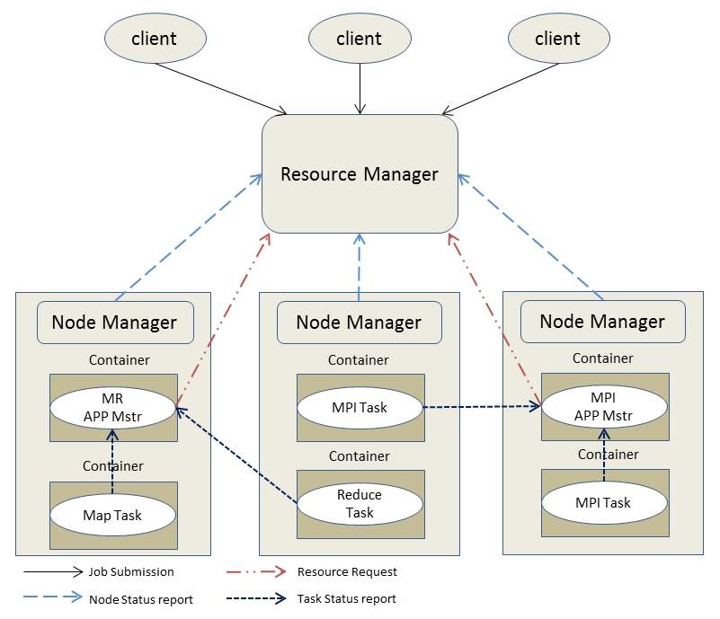
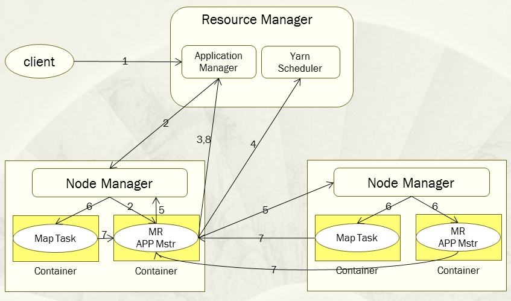

# Yarn框架和工作流程研究

[原文](https://www.cnblogs.com/itboys/p/9184381.html)

## Yarn和MRv1对比

1. 扩展性对比。

    在MRv1中，JobTracker是个重量级组件，集中了资源管理分配、作业控制两大核心功能，随着集群规模的增大，JobTracker处理各种RPC请求负载过重，这也是系统的最大瓶颈，严重制约了Hadoop集群的扩展性。相比之下，Yarn将JobTracker功能进行了拆分，拆分为全局组件ResourceManager、应用组件ApplicationMaster和JobHistoryServer。其中，ResourceManager负载整个系统资源的管理和分配，ApplicationMaster负载单个应用程序的相关管理(job的管理),JobHistoryServer负载日志的展示和收集工作。Yarn的这种功能拆分，将减轻了master节点的负载，其处理的RPC请求的压力得到减少。其实换句话Yarn是将这种负载进行了横向转移到子节点，这个可以通过ApplicationMaster(简称APP Mstr)的机制体现，APP Mstr是运行在其中一个子节点，运行在其他各个子节点的Task只需要向App Mstr发送相关的RPC请求来汇报task运行情况就ok，而不需要直接和master节点的相关进行进行RPC通讯。这个就将MRv1的Master/slave转化为了Master/slave混杂slave/slave的这种结构。

    另外，Hadoop1.x扩展性差问题不仅仅体现在MRv1框架中，提体现在HDSF中。Yarn为了解决这个问题，提出了HDFS Federation,它可以允许集群中启动多个NameNode来分管不同目录的元数据进而实现了访问隔离和横向扩展问题，同时HDFS Federation的提出也彻底解决了hadoop1.x的NameNode单点故障问题。

2. 资源利用率对比。

    MRv1的资源管理分配模型是基于槽位的，槽位是一个相当粗粒度的系统资源单位，一个槽位是系统一定cpu、内存、网络、IO等资源的抽象。一个Slot只能启动一个Task，关键的是一个Task未必用完一个Slot所对应的系统资源，但是它又占着不给别的Task使用，这就造成了浪费。另外，在MRv1中Slot还被分为了Reduce Solt和Map Slot，Reudce solt只能启动Reduce Task，Map Slot只能启动Map Task，这两种Slot不允许共享，因此常常会导致一种Slot资源相当紧张而另外一种Slot资源却是空闲的。例如，当一个Job刚刚被提交的时候，只有当Map Task完成数据为总数量的5%（默认）时，Reduce Task才会启动，那么此时的Reudce Slot就是被闲置浪费了。相比之下，Yarn就克服了上面的问题，Yarn的资源抽象单位container是细粒度的，而且是动态的（目前Yarn版本中只支持cpu和内存的动态分配），他可以为不同的Task需求进行分配，而且container是部分种类的，在MRv框架中可以同时被Map Task和Reduce Task使用。

3. 安全稳定性对比。

    Hadoop1.x对应的HDFS版本中NameNode是存在单点故障的，但是Yarn通过HFDS Federation的提出完美地解决了这个棘手问题。

4. 基本架构特性对比。

    MRv1是单纯地为离线框架Map Reduce打造的，而这种离线计算机框架不能满足现在需求了，一些更有针对性的框架被开发出来，如Spark、storm、DAG计算机框架Tez。这些新的框架无法运行在MRv1上。相比之下，Yarn是一个独立的资源管理系统，其资源和计算机框架是被分离开来的，你可以在Yarn上同时运行MR APP、Spark APP、MPI APP等等。

## Yarn基本架构以及各个组件负责功能

Yarn在整体上看还是采用了和Hadoop1.x一样的Master/Slave结构（横向扩展混杂Slave/Slave结构），在整个Yarn资源管理系统当中，ResourceManager作为Master，各个节点的NodeManager作为Slave。各个节点上NodeManager的资源由ResourceManager统计进行管理和调度。当应用程序提交后，会有一个单独的Application来对该应用程序进行跟踪和管理，同时该Application还会为该应用程序想Resource申请资源，并要求NodeManager启动该应用程序占用一定资源的任务。下图主要以MR和MPI这两种应用来描述Yarn运行的基本架构：

###基本组件介绍：

+ **ResourceManager**
ResourceManager是Yarn的核心组件，主要由任务调度器（YarnScheduler）和应用程序管理器（Applications Manager）组成。其主要功能是负责系统资源的管理和分配。
	- *任务调度器*(YarnScheduler)
	任务调度器根据系统资源容量以及管理员对队列的限制条件，按照一定的策略将资源分配给正在运行的应用程序。相比于Hadoop1.x而言，Yarn为任务调度器做了减负，任务调度器不再负责跟踪和监控应用的执行状态，也不负责重新启动因为应用执行失败或者硬件故障而运行失败的任务，这些任务都有该应用程序对应的ApplicationMaster来负责了，这使得YarnScheduler的功能更加纯粹。另外，任务调度器和Hadoop1.x一样也是一个热插拔模块，你可以自定义自己的任务调度器，同样你也可以直接使用其他任务调度器，如，Fair Scheduler或者Capacity Scheduler。
 	- *应用程序管理器*（Applications Manager）
    应用程序管理器，负责管理整个系统中所有应用程序，包括应用程序提交、向任务调度器申请资源启动ApplicationMaster、监控ApplicationMaster运行状态并在失败时重新启动它。
	- *其他*
    ResourceManager中还包含了其他组件，如ResourceTrackerService用来直接处理心跳，NMLivelinessMonitor用来监控NodeManager，NodesListManager 提供NodeManager的黑白名单等等。

+ **ApplicationMaster(AM)**

    每当用户提交了一个应用程序就会为这个应用程序产生一个对应的ApplicationMaster，并且这个这个单独进程是在其中一个子节点上运行的。它的主要功能：为应用向ResourceManager申请资源、在job对Task实行调度、与NodeManager通信以启动或者停止任务、监控所有任务的运行情况，并且在任务失败的情下，重新为任务申请资源并且重启任务、负责推测任务的执行、当ApplicationMaster向ResourceManager注册后，ApplicationMaster可以提供客户端查询作业进度信息等。

+ **NodeManager(NM)**

    NM是每个子节点上的资源和任务管理器，一方面，它会定向通过心跳信息向RM汇报本节点上的资源使用情况和各个Container的运行情况；另一方面，它会接收并且处理来自AM的Container启动和停止的各种请求。它的能有点像Hadoop1.x中的TaskTracker。

+ **Container**

    Container是Yarn中对系统资源的抽象，同时它也是系统资源分配的基本单位，它封装节点上多维度资源，其中包括CPU、内存、磁盘、网络等。Yarn会为每个任务分配一个Container，并且该任务只能够使用该Container中所描述的资源。值得关注的的是，Yarn中的Container和MRv1中的Slot是完全不同的，Container是一个动态的资源划分单位，它是根据实际提交的应用程序所需求的资源自动生成的，换句话说，Container其里边所描述的CPU、内存等资源是根据实际应用程序需求而变的。而Slot是一个静态的资源抽象单位，每一个同类型的Slot所描述的资源信息都是一样的。

## Yarn工作流
当用户给Yarn提交了一个应用程序后，Yarn的主要工作流程如下图：

1. 用户向Yarn提交应用程序，其中包括用户程序、相关文件、启动ApplicationMaster命令、ApplicationMaster程序等。

2. ResourceManager为该应用程序分配第一个Container，并且与Container所在的NodeManager通信，并且要求该NodeManager在这个Container中启动应用程序对应的ApplicationMaster。

3. ApplicationMaster首先会向ResourceManager注册，这样用户才可以直接通过ResourceManager查看到应用程序的运行状态，然后它为准备为该应用程序的各个任务申请资源，并监控它们的运行状态直到运行结束，即重复后面4~7步骤。

4. ApplicationMaster采用轮询的方式通过RPC协议向ResourceManager申请和领取资源。

5. 一旦ApplicationMaster申请到资源后，便会与申请到的Container所对应的NodeManager进行通信，并且要求它在该Container中启动任务。

6. 任务启动。NodeManager为要启动的任务配置好运行环境，包括环境变量、JAR包、二进制程序等，并且将启动命令写在一个脚本里，通过该脚本运行任务。

7. 各个任务通过RPC协议向其对应的ApplicationMaster汇报自己的运行状态和进度，以让ApplicationMaster随时掌握各个任务的运行状态，从而可以再任务运行失败时重启任务。

8. 应用程序运行完毕后，其对应的ApplicationMaster会向ResourceManager通信，要求注销和关闭自己。

在整个工作流程当中，ResourceManager和NodeManager都是通过心跳保持联系的，NodeManager会通过心跳信息向ResourceManager汇报自己所在节点的资源使用情况。